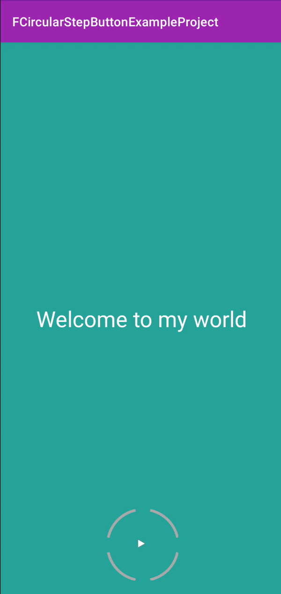

# FCircularStepButton

#Adding to project

To get a Git project into your build:

 
Add it in your root build.gradle at the end of repositories:

	allprojects {
		repositories {
			...
			maven { url 'https://jitpack.io' }
		}
	}
Step 2. Add the dependency

	dependencies {
	        implementation 'com.github.forhad013:FCircularStepButton:1.0.0'
	}

# Usage

- setCurrentStep(int number)
- setDistance(int number) (Distance between each arc)
- setImageViewSize(int imageViewSize) (Square size of imageview)
- setButtonImageSrc(int buttonImageSrc)
- setNumberOfSteps(int numberOfSteps)
- setSubCircleColor(int subCircleColor) (secondary circle color)
- setCircleColor(int circleColor) (main circle color)

 fCircularStepButton.setOnClickListener(view -> {
     if (fCircularStepButton.getCurrentStep() < fCircularStepButton.getNumberOfSteps()) {
           startAnimation();
        }
  });

* start animation

 animation = new ArcAngleAnimation(fCircularStepButton);
        animation.setDuration(1000);
        animation.setAnimationListener(new Animation.AnimationListener() {
            @Override
            public void onAnimationStart(Animation animation) {
                fCircularStepButton.setEnabled(false);
            }

            @Override
            public void onAnimationEnd(Animation animation) {

                if(fCircularStepButton.getCurrentStep() < fCircularStepButton.getNumberOfSteps() -1) {
                    fCircularStepButton.setEnabled(true);
                    currentPosition++;
                    fCircularStepButton.setCurrentStep(currentPosition);
                    fCircularStepButton.setShouldAnimate(false);
                    fCircularStepButton.invalidate();
                    setViewForCurrentStep(currentPosition);
                }else{
                   // go to next page
                }

            }

            @Override
            public void onAnimationRepeat(Animation animation) {

            }
        });

        fCircularStepButton.setShouldAnimate(true);
        fCircularStepButton.startAnimation(animation);

